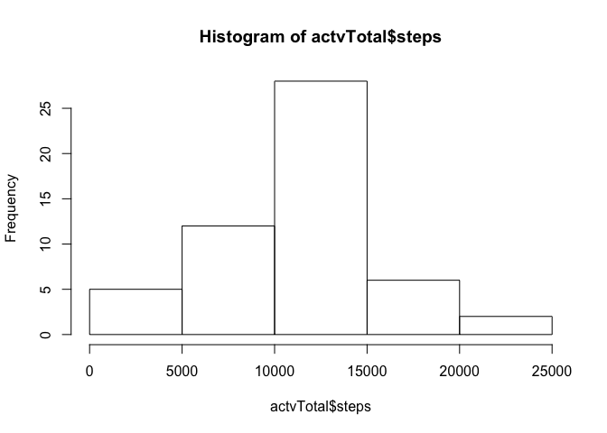
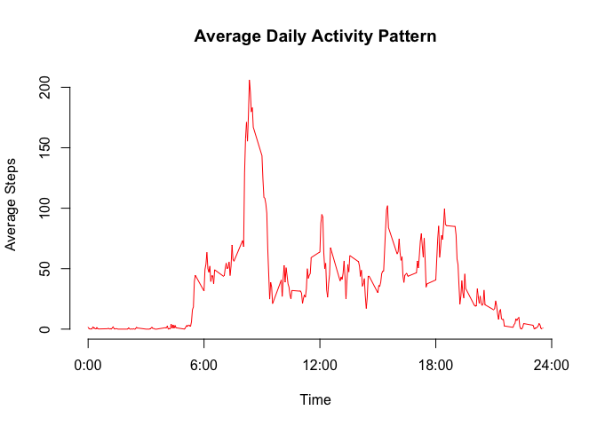
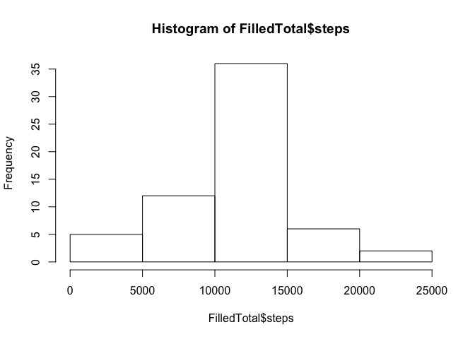

# Reproducible Research: Peer Assessment 1

## Loading and preprocessing the data

```r
actv <- read.csv(file="activity.csv", header=TRUE, sep=",",na.strings="NA")
actv$date <- as.Date(actv$date, format = "%Y-%m-%d")
##omit NAs
actNaRemoved <- actv[!is.na(actv$steps),]
```


## What is mean total number of steps taken per day?
1. Calculate the total number of steps taken per day
2. Make a histogram of the total number of steps taken each day
3. Calculate and report the mean and median of the total number of steps taken per day


```r
library(dplyr)
```

```
## 
## Attaching package: 'dplyr'
```

```
## The following objects are masked from 'package:stats':
## 
##     filter, lag
```

```
## The following objects are masked from 'package:base':
## 
##     intersect, setdiff, setequal, union
```

```r
actvgDate  <- group_by(actNaRemoved,date)
actvTotal  <- summarize(actvgDate,steps = sum(steps))

hist(actvTotal$steps)
```



```r
actvMM  <- summarize(actvTotal,meanAct = mean(steps),medianAct = median(steps))

actvMM
```

```
## Source: local data frame [1 x 2]
## 
##    meanAct medianAct
##      (dbl)     (int)
## 1 10766.19     10765
```

## What is the average daily activity pattern?
1. Make a time series plot  of the 5-minute interval (x-axis) and the average number of steps taken, averaged across all days (y-axis)
2. Which 5-minute interval, on average across all the days in the dataset, contains the maximum number of steps?


```r
library(ggplot2)
actvgInterval  <- group_by(actNaRemoved,interval)
actvMean  <- summarize(actvgInterval,steps = mean(steps))

plot(x=actvMean$interval, y=actvMean$steps,
     axes = F, 
     type="l", 
     col="red", 
     xlab="Time", 
     ylab="Average Steps",
     main="Average Daily Activity Pattern")
axis(1,at=c(0,600,1200,1800,2400), label = c("0:00","6:00","12:00","18:00","24:00"))
axis(2)
```



```r
##get the max number of steps
actvMean[which.max(actvMean$steps),]
```

```
## Source: local data frame [1 x 2]
## 
##   interval    steps
##      (int)    (dbl)
## 1      835 206.1698
```


## Imputing missing values

1. Calculate and report the total number of missing values in the dataset 
2. Devise a strategy for filling in all of the missing values in the dataset.
3. Create a new dataset that is equal to the original dataset but with the missing data filled in.
4. Make a histogram of the total number of steps taken each day and Calculate and report the mean and median total number of steps taken per day.  


```r
##sum of NAs 
 sum(is.na(actv$steps))
```

```
## [1] 2304
```

```r
## new dataset with  Nas  Filled
Filled <- actv
Filled$steps[is.na(Filled$steps)] <- mean(Filled$steps,na.rm = T)

FilledgDate  <- group_by(Filled,date)
FilledTotal  <- summarize(FilledgDate,steps = sum(steps))

hist(FilledTotal$steps)
```



```r
FilledMM  <- summarize(FilledTotal,meanAct = mean(steps),medianAct = median(steps))
```

Do these values differ from the estimates from the first part of the assignment?

```r
meanDiff <- actvMM$meanAct - FilledMM$meanAct
medianDiff <- actvMM$medianAct - FilledMM$medianAct

meanDiff
```

```
## [1] 0
```

```r
medianDiff
```

```
## [1] -1.188679
```
no difference in mean and very minimal difference in median

What is the impact of imputing missing data on the estimates of the total daily number of steps?

```r
totalDiff <- sum(Filled$steps) - sum(actNaRemoved$steps)
totalDiff
```

```
## [1] 86129.51
```


## Are there differences in activity patterns between weekdays and weekends?
1. Create a new factor variable in the dataset with two levels – “weekday” and “weekend” indicating whether a given date is a weekday or weekend day.
2. Make a panel plot containing a time series plot (i.e. 𝚝𝚢𝚙𝚎 = "𝚕") of the 5-minute interval (x-axis) and the average number of steps taken, averaged across all weekday days or weekend days (y-axis). 


```r
Filled$date <- as.Date(Filled$date)
#weekdays vector
weekdaysv <- c('Monday', 'Tuesday', 'Wednesday', 'Thursday', 'Friday')

Filled$wDayEnd <- c('weekend', 'weekday')[(weekdays(Filled$date) %in% weekdaysv)+1L]

FilledgwDayEnd  <- group_by(Filled,interval,wDayEnd)
FilledgwDayEnd  <- summarize(FilledgwDayEnd,steps = mean(steps))

library(lattice)
xyplot(steps ~ interval | wDayEnd, data = FilledgwDayEnd, layout = c(1, 2), type="l", xlab = "Interval", ylab = "Number of steps")
```


